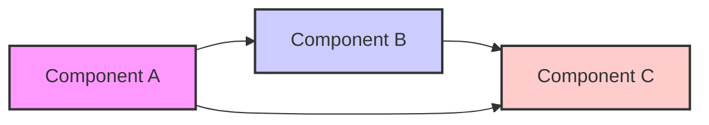

# System Design: [Project Name]

This document outlines the system architecture, design patterns, key technical decisions, and high-level technology choices for the [Project Name] project.

## 1. Architecture Overview

### High-Level Architecture Diagram (Mermaid or similar):

### Component Descriptions: [Describe the major components of the system and their responsibilities. Refer to the components in your diagram above.]

Component A: [Component Name]: [Description of Component A's purpose and functionality.]
Component B: [Component Name]: [Description of Component B's purpose and functionality.]
Component C: [Component Name]: [Description of Component C's purpose and functionality.]
...
### Data Flow: [Describe the flow of data through the system. How do components interact and exchange information? You can use a numbered list or another diagram if helpful.]

[Step 1 in Data Flow]
[Step 2 in Data Flow]
[Step 3 in Data Flow]
...
## 2. Design Patterns
### Design Patterns Used: [List the major design patterns being used in the system. For each pattern, briefly explain why it's being used and where it's applied in the system.]

Pattern 1: [Pattern Name]: [Why is this pattern used? Where is it applied?]
Pattern 2: [Pattern Name]: [Why is this pattern used? Where is it applied?]
...
## 3. Key Technical Decisions
### Major Technical Choices: [Document the significant technical decisions made during the design phase. Explain the rationale behind these choices and any alternatives considered.]

Decision 1: [Decision Description]: [Rationale for this decision. Alternatives considered.]
Decision 2: [Decision Description]: [Rationale for this decision. Alternatives considered.]
...
### Technology Stack (High-Level): [List the major technologies and frameworks being used in the project at a high level. Detailed dependencies go in techEnvironment.md.]

### Programming Language(s): [e.g., Python]
### Major Frameworks/Libraries: [e.g., Langchain, PyTorch, Transformers]
### Database (if applicable): [e.g., SQLite, PostgreSQL]
### Deployment Environment (target): [e.g., Apple Silicon macOS]
...
## 4. Non-Functional Requirements (Architectural Considerations)
### Performance Requirements: [Are there specific performance goals? e.g., response times, throughput, processing speed. Especially relevant for Apple Silicon optimization.]

### Scalability Requirements: [Does the system need to scale to handle increasing data or users? How is scalability being addressed in the architecture?]

### Security Considerations (Architectural Level): [Are there any high-level security considerations that influenced the architecture? e.g., data encryption, access control.]

### Maintainability and Extensibility: [How is the architecture designed to be maintainable and allow for future extensions and modifications?]